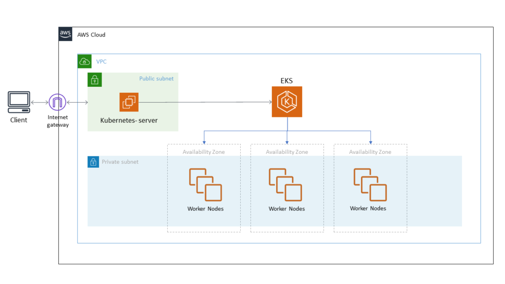
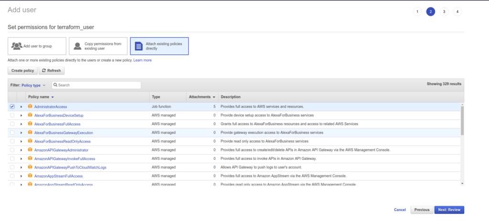
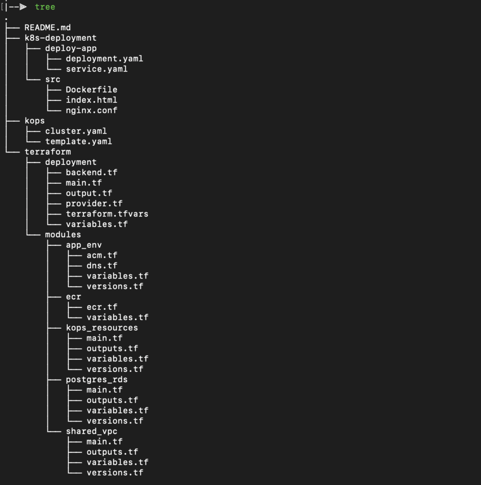
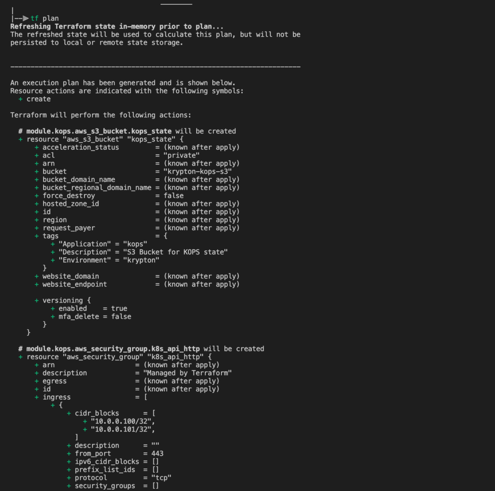
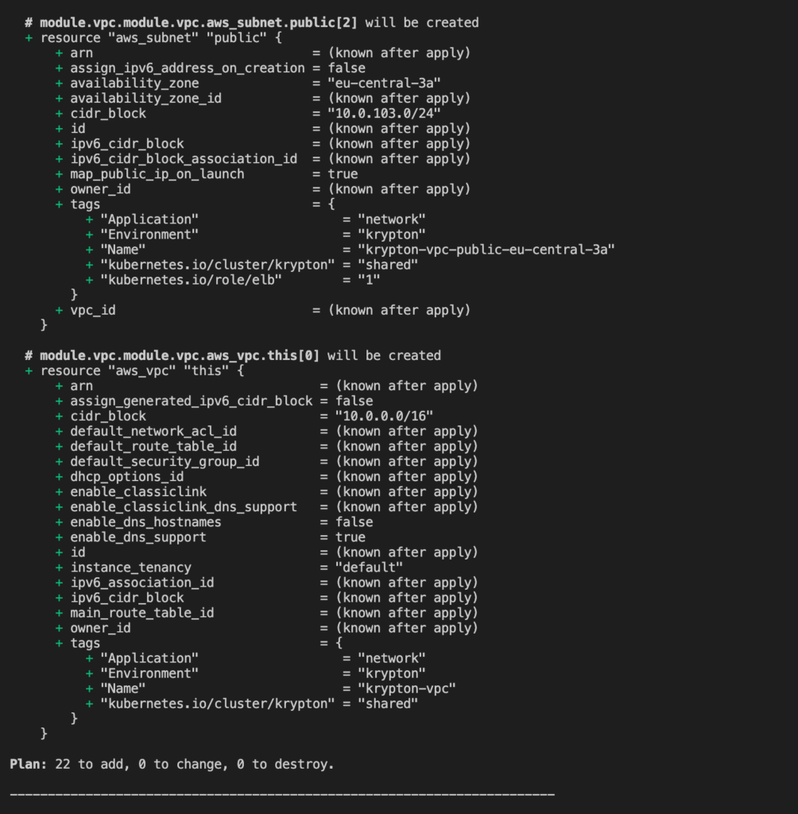
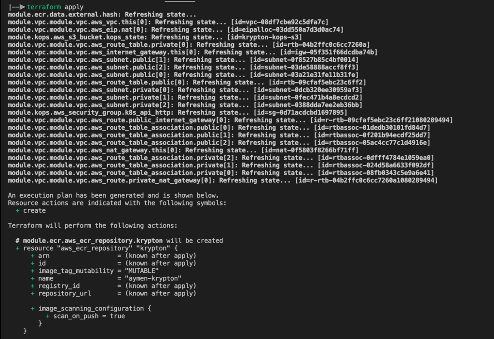

# Setup AWS Managed Kubernetes Cluster using Terraform and KOPS and deploy a sample K8S Application

## Introduction

This readme describes how to deploy a reliable and high available  AWS Mnagaed cluster with [`Terraform`](https://www.terraform.io/) and [`KOPS`](https://github.com/kubernetes/kops).

Amazon Elastic Kubernetes Service (Amazon EKS) is a fully managed [Kubernetes](https://aws.amazon.com/kubernetes/) service.
Kubernetes (K8S) is an open-source system for automating deployment, scaling, and management of containerized applications.
In this project , we will deploy the following architecture using Terraform and KOPS. We used Terraform for the shared VPC, KOPS resources, ECR and the application environment provisioning. We ill use KOPS as the mechanism to install and manage the EKS cluster in AWS. We used [`kubectl`](https://kubernetes.io/docs/reference/kubectl/overview/) to manage the K8S application deployment.

## Architecture



The following table maps most of the AWS products used in this tutorial to their use case in EKS cluster.

| **Service** | **Use case** |
| --- | --- |
| VPC | Provision a logically isolated section of the AWS Cloud |
| ACM | AWS Certificate Manager: provision SSL/TLS certificates |
| ECR | Amazon ECR is a fully-managed [Docker](https://aws.amazon.com/docker/) container registry |
| Kuernetes Server | Bastion host used to ssh the private EKS cluster |
| EKS Worker Nodes | Worker machines,  part of the Kubernetes cluster |
| Internet Gateway | Allows communication between VPC instances and the internet |
| Route 53 | Amazon Route 53 is a cloud DNS service |
| S3 | Amazon Simple Storage Service is an object storage service |

## Assumptions and Prerequisites

* You have basic knowledge of AWS
* Have basic knowledge of Kubernetes
* You have a basic knowledge of Terraform
* You have [Terraform](https://learn.hashicorp.com/terraform/getting-started/install.html) v0.12x / v0.11x installed in your machine
* You mist have kubectl and [KOPS](https://github.com/kubernetes/kops/blob/master/docs/install.md) installed in your machine
* You must have an AWS account, with an [IAM keypair](https://docs.aws.amazon.com/IAM/latest/UserGuide/id_credentials_access-keys.html) which has admin access to your AWS environment.

## Objectives

1. ✅ Use Terraform and KOPS to create an EKS Kubernetes cluster
2. ✅ Create a bastion machine to manage your cluster masters/nodes
3. ✅ Deploy a sample Kubernetes application in the created EKS  cluster
4. ✅ Learn and use HCL (HashiCorp Language), Terraform and KOPS best practices

## Software Dependencies

* [Terraform](https://www.terraform.io/downloads.html) v0.12.x and v0.11x (you can use the [tf switcher](https://warrensbox.github.io/terraform-switcher/) tool)
* Terraform AWS provider plugin [v2.57](https://www.terraform.io/docs/providers/aws/index.html)
* [KOPS](https://github.com/kubernetes/kops/blob/master/docs/install.md)
* [Kubectl](https://kubernetes.io/docs/reference/kubectl/overview/)
* [jq](https://stedolan.github.io/jq/)

## Before you begin

#### Setup the Terraform State environment

In order to deploy EKS with Terraform and KOPS  we need to create 2 resources:

* A S3 bucket (in our tutorial it will be named `terraform-eks-dev`, I recommend to set the versioning)
* A DynamoDB table (in our tutorial it will be named `terraform-state-lock`)

#### Configuring AWS

In order to follow the best practices, let's create a user for Terraform. Go to your AWS console and create `terraform_user` user:


Give it the good rights. In my example, I need Terraform to be able to manage all of my AWS Cloud resources:


Don't forget to store the AWS access key id and secret access key.  Next, you need to copy them in your AWS credential file, you can also execute
$ `aws configure` to add a new user.

````
[terraform_user]
aws_access_key_id = xxxxxxxxxxxxxxxxxxx
aws_secret_access_key = xxx/xxxxxxxxxxxxx/xxxx
````

## Technical setup of our cluster

#### AWS

We are going to create a kubernetes cluster inside a private VPC (we will create it using`terraform`) in the Frankfurt region (`eu-west-1`).
This VPC will have 3 private and 3 public subnets (one per Availability zone).
For our private subnets we will have only 1 NAT gateway (for economy purpose).

#### Kubernetes

Our kubernetes cluster will run in a private topology (i.e. in privates subnets).
The kubernetes API (running on masters node) will only accessible through a Load Balancer (created by `kops`).
All the node won't be internet accessible by default, but using a bastion host we will be able to ssh to them.

The following setup is "prod" ready, we will have 3 masters (one per Availability zone) and 2 nodes.
Kubernetes imposes the following fundamental requirements (shamefully stolen from[here](https://github.com/aws/amazon-vpc-cni-k8s/blob/master/docs/cni-proposal.md)):

* All containers can communicate with all other containers without NAT
* All nodes can communicate with all containers (and vice-versa) without NAT
* The IP address that a container sees itself as is the same IP address that others see it as

So in AWS we need to choose a network plugin. Here we will use the [amazon-vpc-cni-k8s](https://github.com/aws/amazon-vpc-cni-k8s) plugin. It is the recommended plugin and it's maintained by AWS.

To deploy an EKS cluster with Terraform and KOPS, the first step is to obtain the source code from the Github repository.
This will clone the sample repository and make it the current directory

`$ git clone https://github.com/AymenSegni/aws-eks-cluster-tf-kops.git`
`$ cd aws-eks-tf-kops`

Our project directory tree will look like at the end:


#### Project structure

1. Terraform config directory: **`/terraform/`**

a-`modules/`: represent here in this layout the Terraform modules (general re-used functions) . In this lab, we have basically 4 modules:
–`shared_vpc`: Define the shared VPC resources
–`kops_resources`: the AWS resources needed to run the KOPS configs
–`ecr`: Create an AWS ECR repository used to store docker images needed to deploy the kubernetes application later
– `app_env`: Host the Teeraform configs necessary to create a Route 53 dns records and SSL ACM certificate for the kubernetes application deployment
–` postgres_sql:` Integrate a Redis Postgresql instance

`b- Deployment`: Is the root Terraform function of the layout, responsible of the EKS Kubernetes cluster deployment on AWS.
– `main.tf` We define the Terraform modules already created in `/modules` sub-folders with the appropriate inputs defined in `variables.tf` or in a `terraform.tfvars` file (wich is not covered in this guide).
–`provider.tf:` define the AWS provider configuration used by Terraform including the version, the main deployment region and the AWS technical user (terraform_user)
– `backend.tf:` Define the `S3 bucket` and the `dynamodb table` that manage the Terraform state file.

2.  KOPS config directory: **`/kops`**

– `template.yaml` : template the EKS creation in AWS
The rest of the KOPS config files are auto-generated by the KOPS CLI. Only the template file is needed.

 3. Kubernetes Application deployment config directory: **`/k8s-deployment`**

`a- /src`: Holds the application code source, nginx config file and the Dockerfile<br>
`b- /deploy-app`: Manage the K8S application deployment and the service definition

As you can see our terraform and kops configuration are separated. This is because the kops configuration files are fully managed by kops and modifying them is not "persisted" between kops run.

## Terraform deployment setup

So as to deploy EKS with Terraform and KOPS, we need to setup our Terraform deployment in root function at ` /terraform/deployment`
In this stage, we must define the provider and the backend configs as the following:

1- `provider.tf`

````
provider "aws" {
  region  = "eu-west-1"
  version = "~> 2.57"
  profile = "terraform-user"
}
````

2- `backend.tf`

````
terraform {
  backend "s3" {
    region         = "eu-west-1"
    bucket         = "terraform-eks-dev"
    key            = "terraform.tfstate"
    encrypt        = "true"
    dynamodb_table = "terraform-state-lock"
  }
}
````


## Shared VPC resources

We need to setup some Terraform resources that will be used by kops for deploying  k8s EKS cluster but could also be used by other things.

We will use the very good [terraform-aws-vpc](https://github.com/terraform-aws-modules/terraform-aws-vpc) module to avoid having to setup each resource individually.

But first, we need to define the generic TF module `terraform/modules/shared_vpc` that will be used throughout the whole tutorial.
Our VPC will be on the `10.0.0.0/16` with a separation of private and public subnets.

````
#
# VPC Resources
#  * VPC
#  * Subnets
#  * Internet Gateway
#  * Route Tables
#  * Sec Groups

module "vpc" {
  source = "terraform-aws-modules/vpc/aws"

  name = "${var.environment}-vpc"
  cidr = var.cidr

  azs             = var.azs
  private_subnets = var.private_subnets
  public_subnets  = var.public_subnets

  enable_nat_gateway     = true
  single_nat_gateway     = true
  one_nat_gateway_per_az = false

  private_subnet_tags = {
    "kubernetes.io/role/internal-elb" = 1
  }

  public_subnet_tags = {
    "kubernetes.io/role/elb" = 1
  }

  tags = {
    Environment                                = var.environment
    Application                                = "network"
    "kubernetes.io/cluster/${var.cluster_name}" = "shared"
  }
}

````

As you can see we are applying some specific tags to our AWS subnets so that kops can recognize them.

Now let's really apply this configuration to our aws account:
In fact, we need to navigate to the root deployment folder `terraform/deployment/main.tf`, the vpc module deployment is defined as the following:
````
# VPC Module
module "vpc" {

  source          = "../modules/shared_vpc"
  cidr            = var.cidr
  azs             = var.azs
  private_subnets = var.private_subnets
  public_subnets  = var.public_subnets
  environment     = "krypton"
  ingress_ips     = var.ingress_ips
  cluster_name    = var.cluster_name

}
````

## KOPS AWS resources

Let's also create a S3 bucket (with versioning enabled) where `kops` will save the configuration of our cluster.
And a security group to whitelist IPs access to the kubernetes API .
In our project layout the kops resources are defined in the terraform module `/terraform/modules/kops_respources`.

````
resource "aws_s3_bucket" "kops_state" {
  bucket = "${var.environment}-kops-s3"
  acl    = "private"

  versioning {
    enabled = true
  }

  tags = {
    Environment = var.environment
    Application = "kops"
    Description = "S3 Bucket for KOPS state"
  }
}

resource "aws_security_group" "k8s_api_http" {
  name   = "${var.environment}-k8s-api-http"
  vpc_id = var.vpc_id
  tags = {
    environment = var.environment
    terraform   = true
  }

  ingress {
    protocol    = "tcp"
    from_port   = 80
    to_port     = 80
    cidr_blocks = var.ingress_ips
  }

  ingress {
    protocol    = "tcp"
    from_port   = 443
    to_port     = 443
    cidr_blocks = var.ingress_ips
  }
}
````
## Output

The output we define below will be used by `kops` to configure and create our cluster.

`terraform/deployment/output.tf`:

````
output "region" {
  value = "eu-west-1"
}

output "vpc_id" {
  value = module.vpc.vpc_id
}

output "vpc_cidr_block" {
  value = module.vpc.vpc_cidr_block
}

output "public_subnet_ids" {
  value = module.vpc.public_subnet_ids
}

output "public_route_table_ids" {
  value = module.vpc.public_route_table_ids
}

output "private_subnet_ids" {
  value = module.vpc.private_subnet_ids
}

output "private_route_table_ids" {
  value = module.vpc.private_route_table_ids
}

output "default_security_group_id" {
  value = module.vpc.default_security_group_id
}

output "nat_gateway_ids" {
  value = module.vpc.nat_gateway_ids
}

output "availability_zones" {
  value = var.azs
}

output "kops_s3_bucket_name" {
  value = "krypton-kops-s3"
}

output "k8s_api_http_security_group_id" {
  value = module.kops.k8s_api_http_security_group_id
}
output "cluster_name" {
  value = var.cluster_name
}

````

Finally, we can now run Terraform magic (if you use my code, don't forget to comment out all the other resource keep only the vpc and the kops_resources modules  in main.tf)

````
$ cd /terraform/deployment
$ terraform init
$ terraform plan
$ terraform apply
````

$ `terraform plan`  output examples:



Example of the ` $ terraform apply` output


Bingo, our shared resources are done!
We can verify in the AWS console that the krypton-vpc is created and available:


## Deploy EKS with KOPS

`kops/template.yaml`

````
apiVersion: kops/v1alpha2
kind: Cluster
metadata:
  name: {{.cluster_name.value}}
spec:
  api:
    loadBalancer:
      type: Public
      additionalSecurityGroups: ["{{.k8s_api_http_security_group_id.value}}"]
  authorization:
    rbac: {}
  channel: stable
  cloudProvider: aws
  configBase: s3://{{.kops_s3_bucket_name.value}}/{{.cluster_name.value}}
  # Create one etcd member per AZ
  etcdClusters:
  - etcdMembers:
  {{range $i, $az := .availability_zones.value}}
    - instanceGroup: master-{{.}}
      name: {{. | replace $.region.value "" }}
  {{end}}
    name: main
  - etcdMembers:
  {{range $i, $az := .availability_zones.value}}
    - instanceGroup: master-{{.}}
      name: {{. | replace $.region.value "" }}
  {{end}}
    name: events
  iam:
    allowContainerRegistry: true
    legacy: false
  kubernetesVersion: 1.16.0
  masterPublicName: api.{{.cluster_name.value}}
  networkCIDR: {{.vpc_cidr_block.value}}
  kubeControllerManager:
    clusterCIDR: {{.vpc_cidr_block.value}}
  kubeProxy:
    clusterCIDR: {{.vpc_cidr_block.value}}
  networkID: {{.vpc_id.value}}
  kubelet:
    anonymousAuth: false
  networking:
    amazonvpc: {}
  nonMasqueradeCIDR: {{.vpc_cidr_block.value}}
  sshAccess:
  - 0.0.0.0/0
  subnets:
  # Public (utility) subnets, one per AZ
  {{range $i, $id := .public_subnet_ids.value}}
  - id: {{.}}
    name: utility-{{index $.availability_zones.value $i}}
    type: Utility
    zone: {{index $.availability_zones.value $i}}
  {{end}}
  # Private subnets, one per AZ
  {{range $i, $id := .private_subnet_ids.value}}
  - id: {{.}}
    name: {{index $.availability_zones.value $i}}
    type: Private
    zone: {{index $.availability_zones.value $i}}
    egress: {{index $.nat_gateway_ids.value 0}}
  {{end}}
  topology:
    bastion:
      bastionPublicName: bastion.{{.cluster_name.value}}
    dns:
      type: Public
    masters: private
    nodes: private
---

# Create one master per AZ
{{range .availability_zones.value}}
apiVersion: kops/v1alpha2
kind: InstanceGroup
metadata:
  labels:
    kops.k8s.io/cluster: {{$.cluster_name.value}}
  name: master-{{.}}
spec:
  image: kope.io/k8s-1.11-debian-stretch-amd64-hvm-ebs-2018-08-17
  machineType: t2.medium
  maxSize: 1
  minSize: 1
  role: Master
  nodeLabels:
    kops.k8s.io/instancegroup: master-{{.}}
  subnets:
  - {{.}}
---
  {{end}}

apiVersion: kops/v1alpha2
kind: InstanceGroup
metadata:
  labels:
    kops.k8s.io/cluster: {{.cluster_name.value}}
  name: nodes
spec:
  image: kope.io/k8s-1.11-debian-stretch-amd64-hvm-ebs-2018-08-17
  machineType: t2.small
  maxSize: 2
  minSize: 2
  role: Node
  nodeLabels:
    kops.k8s.io/instancegroup: nodes
  subnets:
  {{range .availability_zones.value}}
  - {{.}}
  {{end}}
---

apiVersion: kops/v1alpha2
kind: InstanceGroup
metadata:
  labels:
    kops.k8s.io/cluster: {{.cluster_name.value}}
  name: bastions
spec:
  image: kope.io/k8s-1.11-debian-stretch-amd64-hvm-ebs-2018-08-17
  machineType: t2.micro
  maxSize: 1
  minSize: 1
  nodeLabels:
    kops.k8s.io/instancegroup: bastions
  role: Bastion
  subnets:
  {{range .availability_zones.value}}
  - utility-{{.}}
  {{end}}
````

The above template will be used by the kops templating tool to create a cluster, with:

* 3 master, each in a different availability zone
* 2 nodes
* 1 bastion to have SSH access to any node of our cluster (master and nodes)

#### Using it: the KOPS magic

We are going use our previous terraform output as values for the template (run this in the `kops/` directory).
````
$ TF_OUTPUT=$(cd ../terraform/deployment && terraform output -json)<br> CLUSTER_NAME="$(echo ${TF_OUTPUT} | jq -r .cluster_name.value)"
$ kops toolbox template --name ${CLUSTER_NAME} --values <( echo ${TF_OUTPUT}) --template template.yaml --format-yaml > cluster.yaml
````

Now the `cluster.yaml` contains the real cluster definition. We are going to put in the kops state s3 bucket.
````
$ STATE="s3://$(echo ${TF_OUTPUT} | jq -r .kops_s3_bucket_name.value)"
$ kops replace -f cluster.yaml --state ${STATE} --name ${CLUSTER_NAME} --force
$ kops create secret --name ${CLUSTER_NAME} --state ${STATE} --name ${CLUSTER_NAME} sshpublickey admin -i ~/.ssh/id_rsa.pub
````
The last command will create use your public key in `~/.ssh/id_rsa.pub` to allow you to access the bastion host.

Now that kops state as been updated we can use it to create terraform files that will represent our cluster.

`$ kops update cluster \<br>   --out=. \<br>   --target=terraform \<br>   --state ${STATE} \<br>   --name ${CLUSTER_NAME}`

And let's deploy it on AWS ! 😃

Oops !😬 one thing is missing: KOPS is not yet compatible with `Terraform v0.12x`. In fact, you must downgrade to `Terraform v0.11x` in your terminal before continuing (pro tips: you can use the [Terraform Switcher](https://warrensbox.github.io/terraform-switcher/) tool! 😊
````
$ terraform init
$ terraform plan
$ terraform apply
````

Congratulations! !🎉 our cluster is deployed on AWS with the bastion server and the Load Balancer and all the desired resources


#### Wrapping up

You should now have a cluster with multiple nodes and multiple masters, running on a VPC you control outside of kops.
This cluster uses the AWS VPC CNI plugin ([amazon-vpc-cni-k8s](https://docs.aws.amazon.com/eks/latest/userguide/pod-networking.html)), so pod networking uses the native network of AWS.

You should be able to see all your nodes by running (**don't forget to add your public IP to the cluster security group**)

`$ kubectl get nodes`


We also have a [bastion](https://github.com/kubernetes/kops/blob/master/docs/bastion.md)host to connect to your cluster VMs ! 😄

## Deploy a Kubernetes Application to EKS

Now it's time to deploy a simple application to our cluster. It's just going to be a simple ` nginx` server serving the `index.html`. We will create an `ECR repository` through terraform, create a container image serving the index.html (through a standard nginx container image), build it and push it to the newly created repository.

#### Create ECR repository with Terraform

As As usual, we follow Terraform best practices using Terraform modules to provision our Cloud resources, we defined the Terraform configuration of the ECR service in `/terraform/modules/ecr `

`ecr.tf ` module example:
````
# * main.tf
// Create ECR Repo
resource "aws_ecr_repository" "krypton" {
  name                 = var.image_name
  image_tag_mutability = "MUTABLE"

  image_scanning_configuration {
    scan_on_push = true
  }
}

# * variables.tf

variable "image_name" {
  default     = "krypton"
  description = "ECR Repo name"
  type        = string
}
````

Let's deploy the AWS ECR resource using the root deployment folder: `/terraform/deployment`

````
# .... the rest of modules deployments

# Create ECR Repo and push the app image

# * main.tf
module "ecr" {
  source      = "../modules/ecr"
  image_name  = var.image_name
}

# * variables.tf
# .... the rest of modules variables

variable "image_name" {
  type        = string
  default     = "aymen-krypton"
  description = "App Docker image name"
}
````
Example of the Terraform apply execution output:


#### Build and Push The Docker Image

The source code already contains the `Dockerfile`  needed for the Configs API. Build, tag and push the image using the command below (you can find the push commands in the ECR service console section)

`$ cd /k8s-deployment/src && docker build -t <image_name> .`

`$ docker tag <image_name>:latest <ecr_uri/<image_name>:latest`

`$ docker push <ecr_uri/<image_name>:latest`

#### Deploy and expose the application in EKS K8S cluster

After that, we will deploy an example application to our Kubernetes cluster and expose the website to the outside world. We will use a public load balancer for that and the result should be reachable from the internet via `hello.aymen.krypton.berlin` (feel free to use your own domain name)
Since we want to expose our website securely, we need to get a valid SSL certificate from ACM (we will Terraform) and attach it to the load balancer

The following steps show you how to create a sample application, and then apply the following Kubernetes LoadBalancer [ServiceTypes](https://kubernetes.io/docs/concepts/services-networking/service/#publishing-services-service-types) to our sample application:

**Create a sample application**

1.    To create a sample NGINX deployment, run the following command

`$ cd k8s-deployment/deploy-app`
`$ kubectl apply -f deployment.yaml`

**Create a LoadBalancer service**

1.    To create a **LoadBalancer** service, we created a file called **service.yaml**, and then set **type** to **LoadBalancer**. See the following example:

```
apiVersion: v1
kind: Service
metadata:
  name: aymen-krypton
spec:
  type: LoadBalancer
  selector:
    app: aymen-krypton
  ports:
    - protocol: TCP
      port: 80
      targetPort: 80
```

To apply the **loadbalancer** service, run the following command:

`$ kubectl create -f service.yaml`

**Verify the Deployment**

To verify the Application deployment, we can run the following `kubectl cli`

```
$ kubectl get pods
NAME                             READY   STATUS    RESTARTS   AGE
aymen-krypton-7dc69c7d7d-5bp4w   1/1     Running   0          25h
aymen-krypton-7dc69c7d7d-gx87l   1/1     Running   0          25h
aymen-krypton-7dc69c7d7d-mvrbx   1/1     Running   0          25h
```

```
$ kubectl get services
NAME            TYPE           CLUSTER-IP   EXTERNAL-IP                                                                  PORT(S)        AGE
aymen-krypton   LoadBalancer   10.0.3.6     afe022044489a44d8ae4a47c6f43c44c-2036026668.eu-west-1.elb.amazonaws.com   80:30770/TCP   25h
kubernetes      ClusterIP      10.0.0.1     <none>                                                                       443/TCP        40h
```

#### Create a DNS crecord and generate a valid SSL certificate

In order to finalise the deploy of EKS using Terraform and KOPS, we should create a dns record for our deployed application using AWS Route 53 service, then we will generate a valid SSL certificate and attach it the application Load Balancer. To do all of that we will use Terraform of course !😍

As the other modules,  we defined the Terraform configuration of the application environment resources  in `/terraform/modules/app_env ` as the following:
````
# * acm.tf

# Create an AWS certificate for hello.aymen.krypton.berlin
resource "aws_acm_certificate" "cert" {
  domain_name       = aws_route53_record.hello.name
  validation_method = "DNS"

  tags = {
    Environment = "Krypton"
    Terraform   = "true"
  }

  lifecycle {
    create_before_destroy = true
  }
}

# * dns.tf
# Data source dns zone
data "aws_route53_zone" "zone" {
  name         = var.zone_name
}

# The Application public LB created by the K8S deployment in /k8s-deployment
data "aws_elb" "lb" {
  name = var.k8s_app_lb_name
}

# Create hello.aymen.krypton.berlin route53 record
resource "aws_route53_record" "hello" {
  zone_id = data.aws_route53_zone.zone.zone_id
  name    = "hello.${data.aws_route53_zone.zone.name}"
  type    = "CNAME"
  ttl     = "300"
  records = [data.aws_elb.lb.dns_name]
}
# * variables.tf

variable "k8s_app_lb_name" {
  type        = string
  description = "the K8S app public LB"
}
variable "zone_name" {
  type        = string
  default     = "aymen.krypton.berlin."
  description = "Main zone name"
}
````

Now, let's  deploy the AWS ACM and Route 53 resource using the root deployment folder: `/terraform/deployment`.

````
# * deployment/main.tf
# .... the rest the modules deployments
module "app_env" {
  source          = "../modules/app_env"
  k8s_app_lb_name = var.k8s_app_lb_name
  zone_name       = var.zone_name
}
# * deployment/variables.tf
# .... the rest the modules variables

variable "k8s_app_lb_name" {
  type        = string
  description = "the K8S app public LB"
}
variable "zone_name" {
  type        = string
  default     = "aymen.krypton.berlin."
  description = "Main zone name"
}
````

Now let's keep the rest on Terraform

`$ terraform init`

`$ terraform plan`

`$ terraform apply`

#### Explore the Application

Excited to see the results of this long journey 😄 ? So am I too.
Well let's navigate to my favorite web browser and type: ` hello.aymen.krypton.berlin `


**BingoO**  !🥳 Congratulations! our application has been successfully deployed on our Kubernetes cluster!

